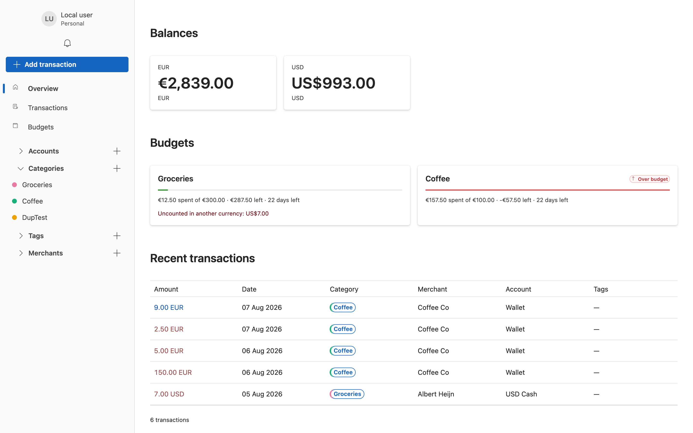
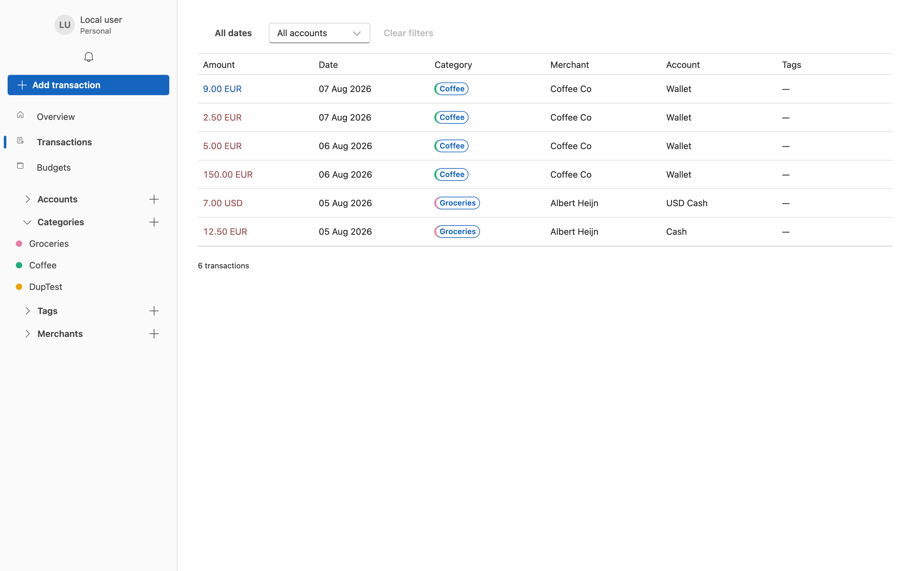
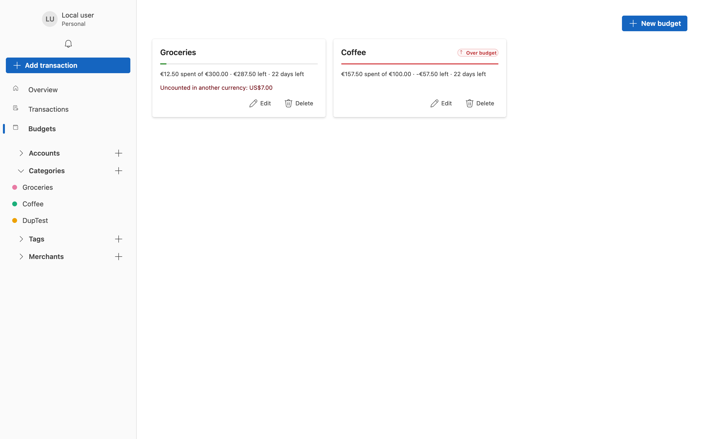
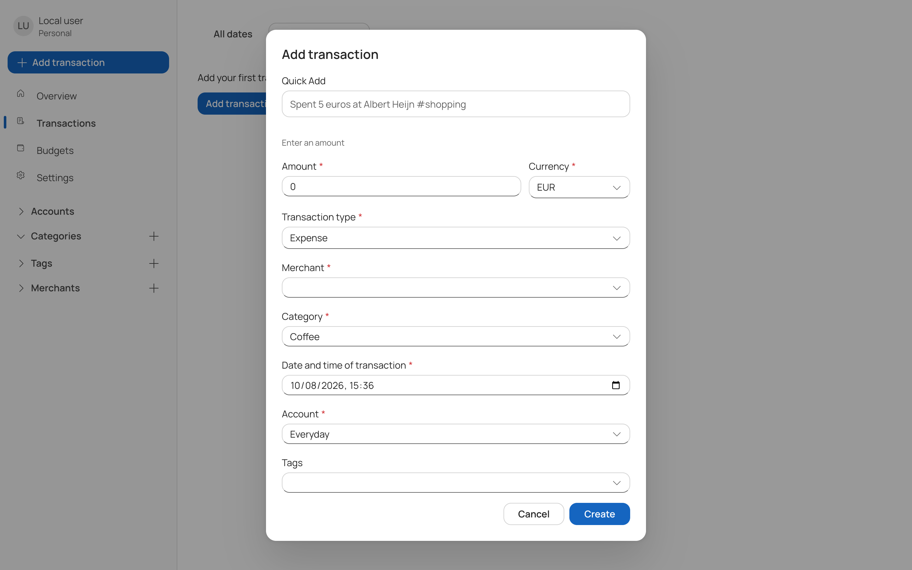

# Xpense

A self-hosted personal finance ledger in which the server cannot read the stored financial data.

Xpense records transactions that have already taken place and reports on them. It maintains
balances in multiple currencies and performs no conversion between them, on the principle that a
converted figure stored in a ledger cannot be reproduced or audited afterwards.



## Design intent

Xpense is intended for users who prefer to host their own financial records rather than delegate
them to a third-party service. Encryption keys are held in the browser; the database stores
ciphertext. The trade-off is explicit: there is no hosted service, no automated bank import, and no
operator-initiated password reset.

| Suitable when | Unsuitable when |
| --- | --- |
| Self-hosting is acceptable or preferred | A managed, hosted service is required |
| The operator must not be able to read stored data | Automated bank or card imports are required |
| Recovery material can be stored safely | An administrative recovery path is required |

## Features

| Area | Description |
| --- | --- |
| Authentication | Passkey-based. A single passkey both authenticates the user and unlocks the encrypted vault |
| Accounts | Unlimited accounts, each denominated in one currency for its lifetime |
| Transactions | Income, expense and transfer, with a deterministic natural-language entry field |
| Categories | Ranked on a five-level necessity scale for discretionary-spending analysis |
| Tags and merchants | Free-form labels and counterparties, creatable inline during entry |
| Budgets | Weekly, monthly, yearly or single-period. Budgets report and never block a transaction |
| Multi-currency | Balances and budgets reported per currency, with no conversion |
| Sharing | Per-resource grants to a group. Currently exposed through the API only |
| Notifications | Raised once when a budget limit is crossed |
| Encrypted vault | Keys are held client-side; the server stores ciphertext it cannot decrypt |

## Requirements

- Docker, for PostgreSQL and the API containers
- .NET 10 SDK and Node 24, to run either component on the host
- A browser and authenticator supporting **passkeys with the PRF extension**

The PRF requirement is not optional: the vault key is derived from the PRF output. An authenticator
without PRF support is rejected during registration rather than being allowed to create a vault
that could never be unlocked.

## Installation

```bash
make start
```

This starts PostgreSQL, applies migrations, and runs the API, the notifications worker and the web
client. Open `http://localhost:5173` and select **Create one** to register an account.

Configuration and the full set of `make` targets are documented in
[docs/getting-started.md](docs/getting-started.md).

## Documentation

The documentation index is [docs/README.md](docs/README.md).

| Guide | Contents |
| --- | --- |
| [Getting started](docs/getting-started.md) | Running the stack, configuration, first account |
| [Users and access](docs/users-and-access.md) | Passkeys, sessions, recovery, groups, invitations |
| [Accounts](docs/accounts.md) | Currency assignment, balances, the default account |
| [Transactions](docs/transactions.md) | Transaction kinds, entry, filtering, amendment |
| [Categories](docs/categories.md) | Categories and the necessity scale |
| [Tags](docs/tags.md) · [Merchants](docs/merchants.md) | Labels, colours, typeahead, inline creation |
| [Budgets](docs/budgets.md) | Periods, progress reporting, uncounted currencies |
| [Notifications](docs/notifications.md) | Triggers and the delivery mechanism |
| [Multi-currency](docs/multi-currency.md) | The no-conversion rule and its consequences |
| [Security and encryption](docs/security-and-encryption.md) | Threat model, key hierarchy, data modes |
| [API reference](docs/api-reference.md) | All routes, grouped by feature |

## Screenshots

| | |
| --- | --- |
|  |  |
| **Transactions** — filtering by date, account, category, tag and merchant | **Budgets** — progress, limit breach, and spending in a currency the budget cannot count |



The entry form accepts a plain sentence and populates the fields it recognises. The parser is
deterministic — no model inference and no network request — and marks unresolved values rather than
inferring them.

## Architecture

| Directory | Contents |
| --- | --- |
| [`api/`](api/) | ASP.NET Core on .NET 10, PostgreSQL, and a separate notifications worker |
| [`web/`](web/) | React 19 and Fluent UI v9 on Vite, in TypeScript |

The API follows a vertical-slice structure: each endpoint is defined in a single file containing its
route, request, validator and handler, and slices do not reference one another. Architecture
decisions are recorded in [`api/docs/adr/`](api/docs/adr/), domain terminology in
[`api/UBIQUITOUS_LANGUAGE.md`](api/UBIQUITOUS_LANGUAGE.md), and contribution conventions for both
trees in [`AGENTS.md`](AGENTS.md).

## Current limitations

The following are known and intentional as of this release.

| Limitation | Detail |
| --- | --- |
| Not fully zero-knowledge | Encrypted records, group names and envelopes are stored as ciphertext, but the legacy plaintext financial tables have not yet been migrated into the encrypted store. The database as a whole should not be described as unreadable until that migration completes |
| Recovery is API-only | Recovery files and recovery passwords are fully implemented in the API and the client cryptography, but the sign-in page currently accepts passkeys only |
| Sharing is API-only | Groups, resource grants and invitations are implemented and tested, but no user interface calls them. The same applies to registering an additional passkey |
| Alert thresholds do not notify | A budget stores and reports its alert threshold, but only a limit breach raises a notification |
| Supported currencies | EUR and USD |
| Analytics | A single endpoint reporting the current day's spending by category. No charts are implemented |
| No administrative recovery | If all unlock methods are lost, the data cannot be recovered by anyone |

## Testing

```bash
make test           # .NET suite; requires Docker for Testcontainers
cd web && npm test  # web suite
```

## Continuous integration

`api/**` and `web/**` have separate workflows, each triggered only by changes within its own tree.
The API workflow builds, tests, reports coverage and smoke-tests the Compose stack. The web workflow
installs from the lockfile, builds, runs the module-initialisation check and audits dependencies.
