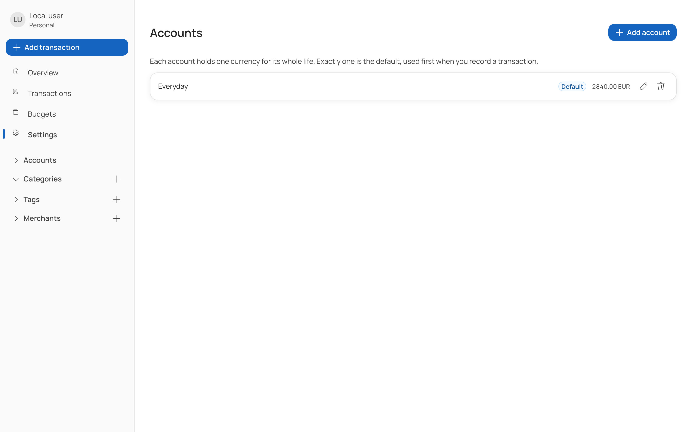

# Accounts

An account is a place your money sits — a current account, a savings pot, a cash wallet. Every
transaction names at least one.

## Fields

| Field | Notes |
| --- | --- |
| Label | Required, up to 200 characters |
| Currency | Chosen once, at creation, and fixed for the life of the account |
| Opening balance | Required, zero or more, entered as you write it — `250` or `250.75` |
| Default | Exactly one account is the default, pre-selected on new transactions |

## Creating one

Accounts are managed on the **Settings** page rather than from the sidebar, so a new one is a
deliberate act rather than one stray click. The sidebar lists your accounts for filtering only.

The opening balance carries a currency, and that currency denominates the account forever. The
update form deliberately offers only the label and the default flag — there is no path to change an
account's currency, because every transaction already recorded against it is denominated in the
old one.

If you need the same money in another currency, create a second account. Two currencies of cash
are two accounts.

## The default account

Exactly one account is the default. The first one you create takes the flag and cannot give it up,
because something has to be the default. Marking another account as default warns you by name that
the current one is about to lose it, and clears it there when you save.

## How balances are computed

A balance is an opening balance plus everything that has moved since:

- Income into the account adds to it.
- An expense from it subtracts.
- A transfer subtracts from the source and adds to the destination.

Balances are **grouped by currency and never summed across currencies**. The overview shows one
tile per currency. A total mixing euros and dollars would be a number that is true of nothing.

In encrypted mode the server holds only ciphertext and cannot compute anything, so your browser
recomputes balances from the opening balances and the transactions it has decrypted. If the vault
is locked, the balance tile says so rather than showing a stale figure.

## Deleting an account

Deletion is soft — the record is marked deleted and kept, so transactions that referred to it stay
intelligible.

## Account numbers

Every account gets a generated public account number, starting from `1000000000`. The API uses that
number in its routes, never the database key. The internal identifier is deliberately never
exposed. See [ADR 0002](../api/docs/adr/0002-account-number-is-the-public-identifier.md).

## Rules you will meet

| Situation | What happens |
| --- | --- |
| Opening balance below zero | Rejected |
| Empty label, or over 200 characters | Rejected |
| Recording an amount whose currency differs from the account's | Rejected — never converted |
| Transfer whose two accounts differ in currency | Rejected |
| Transfer where the source cannot cover the amount | Rejected |
