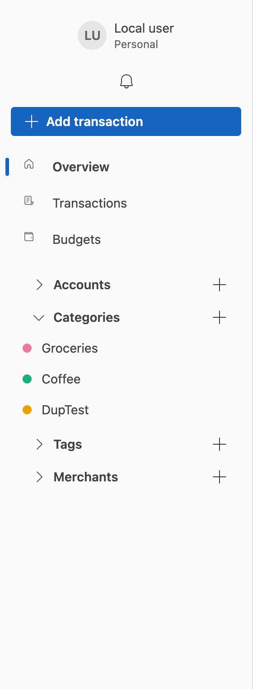

# Categories

A category says what a transaction was for — Groceries, Coffee, Rent. Every income and expense
carries exactly one. Transfers carry none, because moving your own money between your own accounts
is not spending.

## Fields

| Field | Notes |
| --- | --- |
| Label | Required, up to 200 characters |
| Necessity | One of the five values below. Defaults to *Useful* |

Create one with the **+** beside *Categories* in the sidebar. Selecting a category filters the
transaction list to it.

## The necessity scale

Every category is ranked by how essential it is. This is what lets Xpense answer "how much of my
spending was avoidable?" rather than only "where did it go?".

| Necessity | Weight | Means |
| --- | --- | --- |
| Essential | 1 | You cannot go without it — rent, utilities, staple food |
| Important | 2 | Hard to cut, but not survival |
| Useful | 3 | Genuinely worth the money. The default |
| Optional | 4 | Pleasant, easily dropped |
| Avoidable | 5 | You would rather not have spent it |

The scale is fixed reference data, shipped in a migration rather than seeded at runtime, so every
installation ranks spending the same way. See
[ADR 0005](../api/docs/adr/0005-reference-data-lives-in-migrations.md). You cannot add or rename
the levels; you choose which one each category sits at.

A category has exactly one necessity. A necessity covers any number of categories.

Earlier versions used *High*, *Medium* and *Low*. Those names still resolve — High to Important,
Medium to Useful, Low to Optional — so older data keeps its meaning.

## Deleting a category

Deleting a category also deletes the budgets that measured it, since a budget with no category
measures nothing. The client removes both together.

Existing transactions keep referring to the deleted category; deletion is soft.
