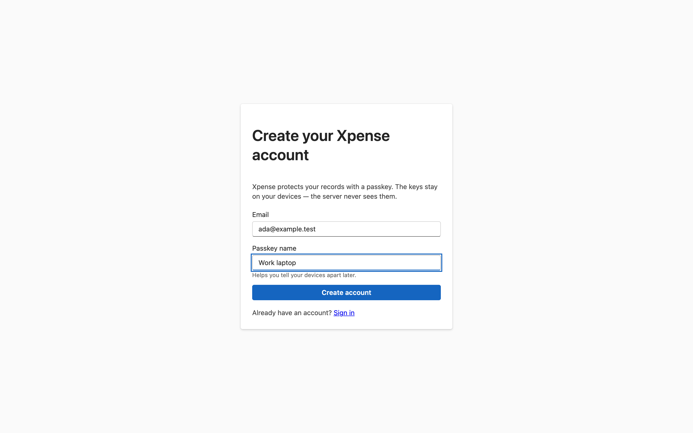
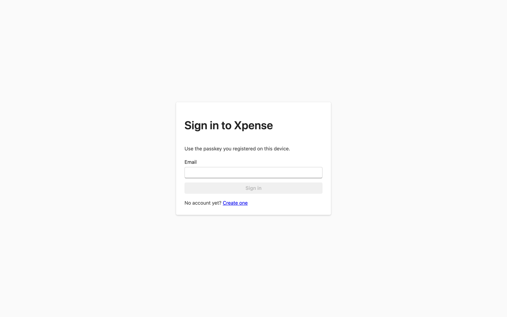

# Getting started

## Requirements

- Docker, for PostgreSQL and the API containers
- .NET 10 SDK and Node 24 if you want to run either side on the host — CI builds the client on
  Node 24.x
- A browser and an authenticator that support **passkeys with the PRF extension** — this is not
  optional. Xpense derives your vault key from the passkey, so an authenticator without PRF cannot
  protect a vault and registration will refuse it.

## Running everything

From the repository root:

```bash
make start
```

That brings up PostgreSQL, runs the migrations container, starts the API and the notifications
worker, then runs the web dev server in the foreground. The API listens on
`http://localhost:4000`, the client on `http://localhost:5173`.

| Command | What it does |
| --- | --- |
| `make start` | API stack in containers, then the web dev server |
| `make start api` | Only the containers — Postgres, migrations, API, notifications |
| `make start web` | Only the Vite dev server |
| `make start dev` | Database in Docker, API and web on the host, both hot-reloading |
| `make stop` | Stop the containers |
| `make logs` | Follow container logs |
| `make build` | Build images and the production bundle |
| `make test` | The .NET test suite (needs Docker — it uses Testcontainers) |

`make start dev` is the loop to use while changing code, because `dotnet watch` and Vite HMR both
apply. It frees ports 4000 and 5173 before starting: `dotnet watch` and Vite each spawn the real
server as a grandchild process, and Ctrl-C does not always reap it. A leftover on 4000 aborts the
API with *address already in use*; a leftover on 5173 quietly pushes Vite to 5174, which breaks the
API's allowed origin and the passkey ceremony with it.

## Creating your first account

1. Open `http://localhost:5173`. With no session you land on the sign-in page.
2. Choose **Create one**.
3. Enter an email and, optionally, a name for this passkey so you can tell your devices apart.
4. Choose **Create account** and complete the passkey prompt.



The browser generates your vault keys during this step and sends the server only encrypted
material. You are signed in and unlocked immediately afterwards.

Returning later, the sign-in page takes the email and the passkey:



Signing in establishes the session. Unlocking the vault is a second step, because the key needed to
unwrap it is not known until the server has told the client which passkeys exist.

## Registration policy

An operator controls who may register, through `Authentication__Registration`:

| Value | Effect |
| --- | --- |
| `Open` | Anyone who reaches the page may register. The default in development. |
| `InviteOnly` | Registration requires a valid, unexpired invitation matching the email |
| `Closed` | No registration at all |

## Configuration

The API reads its configuration from environment variables; `api/.env.example` is the starting
point and `make start` copies it to `api/.env` on first run.

| Variable | Purpose |
| --- | --- |
| `POSTGRES_PASSWORD` | Database password, required |
| `XPENSE_AUTH_RP_DOMAIN` | Passkey relying-party domain, `localhost` in development |
| `XPENSE_AUTH_ORIGIN` | The exact browser origin allowed to complete ceremonies |
| `XPENSE_AUTH_REGISTRATION` | `Open`, `InviteOnly` or `Closed` |
| `XPENSE_PUBLIC_URL` | The URL used in invitation links |
| `XPENSE_EMAIL_*` | SMTP settings; with email disabled, invitation links are returned to the owner instead |
| `XPENSE_DATA_MODE` | `legacy` or `encrypted` — see [Security and encryption](security-and-encryption.md) |

Outside development the relying-party domain may not be `localhost` and the public URL must use
HTTPS. The API validates both at startup and refuses to run otherwise.

## Development notes

- Migrations are a deployment step, never a startup step. The migrations container runs once and
  exits before the API starts.
- The web project has no linter: `typescript-eslint` does not support TypeScript 7, so `tsc` under
  `strict` is the only static check.
- `npm test` runs the unit suite; `npm run test:browser` runs the tests that need a real browser,
  including the checks that no plaintext leaves the page.
