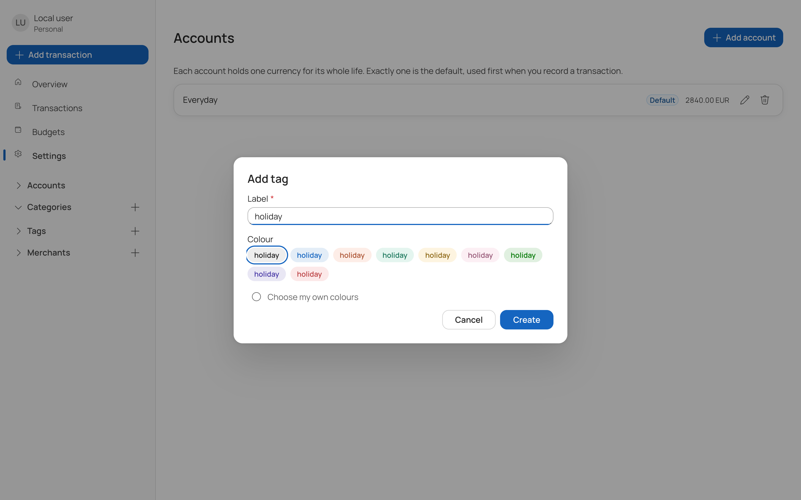

# Tags

A tag is a free-form label you attach to a transaction. Where a category is the single answer to
"what was this for?", tags are for everything that cuts across categories — `holiday-2026`,
`reimbursable`, `shared-with-sam`.

A transaction may carry any number of tags, or none.

## Fields

| Field | Notes |
| --- | --- |
| Label | Required, up to 100 characters |
| Colour | Chosen from a set of presets, or named by hand |

You pick a colour from a row of preset chips, each previewing the tag as it will look. The presets
come from the eight category slots in the design tokens, tinted for a background and deepened for
the text, and every one is checked to clear 4.5:1 contrast — so no preset can produce a tag you
cannot read.

If none of them suit, **Choose my own colours** exposes the background and foreground directly.
Those accept 3 or 6 hex digits, with or without a leading `#`; anything else is rejected with a
message showing the expected shape. Both are stored without the `#`.

Create a tag with the **+** beside *Tags* in the sidebar. Tags you type into the transaction form
are created inline if they do not exist yet, so you do not have to define one before using it.

## Colour and readability

You pick both colours yourself rather than a single one, so a tag stays legible on both the light
and dark themes. The client checks the contrast between the pair when rendering the chip.

## Filtering by tag

Selecting a tag in the sidebar filters the transaction list to transactions carrying it. Tag
filters combine with the category, merchant, account and date filters.

## Deleting a tag

Deletion is soft. Transactions that carried the tag keep their history, and any filter currently
pointing at the deleted tag is dropped with a note saying so, rather than silently returning an
empty list.
