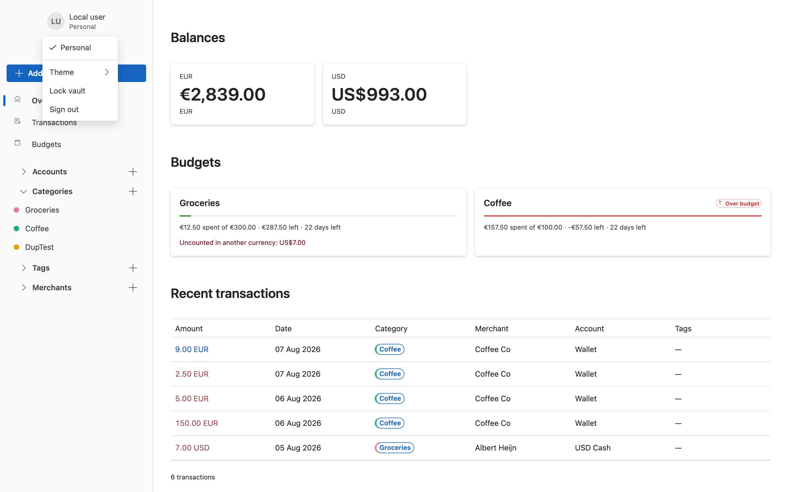

# Users and access

Xpense has no passwords. You register with a passkey, and that same passkey both proves who you are
and unlocks your encrypted data.

## Registering

1. Go to `/register`, or follow **Create one** from the sign-in page.
2. Give an email and, optionally, a name for this passkey.
3. Complete the passkey prompt.

Behind that single click, your browser:

- creates a passkey and asks it for a PRF output — a secret only that authenticator can reproduce
- generates a vault master key and an encryption identity keypair
- encrypts the private key with the master key
- wraps the master key with a key derived from the PRF output
- sends the server the public key and the encrypted material, and nothing else

The server never receives the master key, the PRF output, or anything that would let it derive
them.

**Your authenticator must support the PRF extension.** Without it there is no secret to derive a
vault key from, so registration stops and says so rather than creating an account that could never
be unlocked.

## Signing in and unlocking

These are two separate steps, and it is worth knowing why.

**Signing in** proves who you are and establishes the session cookie.

**Unlocking** decrypts your data. It needs the salt stored alongside your vault wrapper, and the
client cannot know which wrapper to use until the server has told it which passkeys your account
has. So the vault unlock is a second prompt after sign-in.

You can lock the vault at any time from the identity menu without ending the session.

The vault also locks itself after 15 minutes idle, and after 15 minutes with the tab hidden. The
master key is never written to disk unlocked, so reloading the page always requires unlocking
again.

## Signing out

**Sign out** in the identity menu locks the vault first and then ends the session, so nothing
readable survives even if the network call fails. You are returned to the sign-in page.

## Sessions and CSRF

Reads use the `xpense.session` cookie. Anything that changes data additionally needs the
`X-Xpense-Antiforgery` header paired with the `xpense.antiforgery` cookie; the client fetches a
fresh token before every mutation.

## Recovery

If you lose the device holding your passkey, these are the ways back in, in order of preference:

1. **A synced passkey.** If your passkey syncs through a platform keychain, another device
   reproduces the same PRF output and simply works.
2. **Another unlocked device.** Any device with the vault open can add a new passkey wrapper for a
   new device.
3. **A recovery password.** Stretched with Argon2id — 64 MiB, 3 iterations, 4 lanes, a random
   128-bit salt, minimum 14 characters.
4. **A recovery file.** A downloadable text file holding an authentication token and a separate
   vault secret. The server stores only a hash of the authentication token; the vault secret never
   crosses the network. Each file is single-use, and an unlocked client immediately issues a
   replacement.

**There is no operator override and no support reset.** No master key exists on the server. If you
lose every method above, the data is gone. That is the cost of the server not being able to read
it.

The recovery endpoints and all the cryptography for options 3 and 4 are implemented, but **the
sign-in page does not offer them yet** — it currently accepts a passkey only. Until that lands,
treat a synced passkey or a second unlocked device as your real recovery path.

## Groups and sharing

> **Available over the API only.** The endpoints below exist and are covered by tests, but no
> screen in the client calls them yet. Until that lands, groups, grants and invitations are driven
> over HTTP rather than from the interface. Registering a second passkey is in the same position.

Xpense can share a specific account or budget with someone else without exposing everything.

- A **group** has an owner and members. Its name is stored encrypted — the server never learns it.
- A **grant** shares one resource with a group as **Viewer** or **Editor**.
- Keys travel to members as HPKE envelopes sealed to each member's public key, so the server passes
  them along without being able to open them.

Revoking access rotates the group key and the affected record keys. Data a person already saw
cannot be unseen, and the interface says so plainly rather than implying otherwise.

## Invitations

An owner invites someone by email. Invitations last **seven days**.

With email disabled — the default in development — the create response returns a one-time link for
the owner to pass on by hand, so sharing works without an SMTP server.

Under the `InviteOnly` registration policy, a valid invitation matching the email is required to
register at all.

## How access is decided

There are no global query filters. Every request answers "may this user see this thing?" as an
explicit query joining the user, group, membership, grant and resource.

When you are not allowed to know a private resource exists, the answer is a plain **404** — the
same 404 you would get if it never existed, if it was deleted, or if your access was revoked. The
API never returns 403 for these, because a 403 would confirm the thing is real. See
[ADR 0009](../api/docs/adr/0009-authorization-is-an-explicit-query.md).
